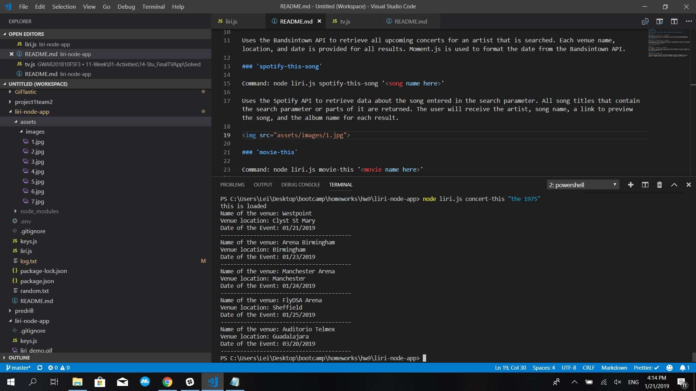

# liri-node-app

## LIRI Bot for HW#10

###Technologies used: Javascript, Node.js, Moment.js, Bandsintown API, Spotify API, OMDb API

### 'concert-this'

Command: node liri.js concert-this <artist/band name here>

Uses the Bandsintown API to retrieve all upcoming concerts for an artist that is searched. Each venue name, location, and date is provided for all results. Moment.js is used to format the date from the Bandsintown API.

### 'spotify-this-song'

Command: node liri.js spotify-this-song '<song name here>'

Uses the Spotify API to retrieve data about the song entered in the search parameter. All song titles that contain the search parameter or parts of it are returned. The user will receive the artist, song name, a link to preview the song, and the album name for each result.

### 'movie-this'

Command: node liri.js movie-this '<movie name here>'

Uses the OMDb API to retreive data about the movie entered in the search parameter. The result will include the title, release year, IMDb rating, Rotten Tomatoes rating, country or countries it was filmed in, langauge(s), plot, and actors/actresses in the film.

### 'do-what-it-says'

Command: node liri.js do-what-it-says

a command that reads the random.txt file and executes the parameters inside of it. By default it is set to 'spotify-this-song,I Want It That Way', but this can be changed to any of the other commands with any search parameter.   Example#1: spotify-this-song,"I Want it That Way" Example#2: movie-this,"Die Hard"
